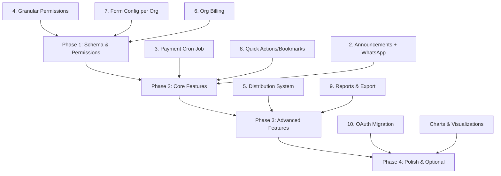

# Non-Profit Organization Management Platform - Full Feature Plan

## Current State

The app already has:

- **Multi-tenancy** with Organization model (name, slug, isActive)
- **Users** with 3 roles: `super_user`, `admin`, `user`
- **Person** model with demographics, `membershipId`, `relationToHOH` (already implemented)
- **Membership** model with HOD, spouse, dependents, payment period (Monthly/Quarterly/Annually)
- **Payment system** with PaymentDue and Payment models, manual due generation
- **Dashboard** with stats and 4 flow tabs (Person, Membership, Payment, Admin)
- **QR code** generation and scanning
- **JWT auth** with role-based middleware
- Frontend: Next.js 14, Tailwind, Radix UI, shadcn-style components

---

## Feature 1: Person Model Enhancements (Already Done)

Person already has `membershipId` (optional FK to Membership) and `relationToHOH` enum. When a person is removed from a membership, Prisma's `onDelete: SetNull` handles cleanup.

**Status: Complete** - No work needed.

---

## Feature 2: Announcements & WhatsApp Messaging

### Backend

- New models in [be/prisma/schema.prisma](be/prisma/schema.prisma):

```
AnnouncementGroup
  - id, name, description, organizationId, createdByUserId, createdAt, updatedAt
  - Relation: many-to-many with Person via AnnouncementGroupMember

AnnouncementGroupMember
  - id, groupId, personId
  - Unique: [groupId, personId]

Announcement
  - id, groupId, organizationId, message, sentAt, sentByUserId, status (draft/sent/failed)
  - createdAt, updatedAt
```

- New API routes: `POST/GET /announcement-groups`, `POST/DELETE /announcement-groups/:id/members`, `POST /announcements`
- When sending to a group, the system resolves recipients by collecting the **WhatsApp number of the Head of Household** for each membership associated with group members
- Special group option: "All Members" sends to every HOD's WhatsApp number in the organization
- Announcements also use the **MessageQueue** table (same as payment hooks) with event type `ANNOUNCEMENT`
- WhatsApp integration: will call the user-provided custom WhatsApp API endpoint for each recipient (connected later)

### Frontend

- New "Announcements" tab or section in dashboard flows
- Group management UI: create group, add/remove persons (searchable by name)
- Message composer: select group, write message, send
- Sent history with delivery status (from MessageQueue)

---

## Feature 3: Automated Payment Due Generation (Cron Job)

### Cron Job

- Add a cron job using `node-cron` that runs on the **1st of every month**
- Reuses existing `generate-dues` logic but runs automatically
- Skips if due already exists for that period (idempotent via `[membershipId, period]` unique constraint)

### Due Generation Schedule

- **Monthly**: Generate a due on the 1st of each month for that same month (e.g., March 1st generates March due)
- **Quarterly**: Generate a due on the 1st of each quarter start month (Jan 1, Apr 1, Jul 1, Oct 1) for that quarter
- **Annually**: Generate a due on **January 1st** for the full year

### Pro-Rata (Organization-Level Setting)

Add 3 boolean toggles to the Organization model:

- `proRataMonthly` (default: false) - If enabled: when a member joins mid-month, generate an immediate partial due = (membershipFee / 30) * remaining days. If disabled: first due starts next month.
- `proRataQuarterly` (default: false) - If enabled: when a member joins mid-quarter, generate an immediate partial due = (quarterlyFee / 3) * remaining months in quarter. If disabled: first due starts next quarter.
- `proRataYearly` (default: false) - If enabled: when a member joins mid-year (e.g., October), generate an immediate due for remaining months = (yearlyFee / 12) * remaining months until December. On January 1st, full year due starts. If disabled: first due starts next January.

Pro-rata dues are generated **at the time of membership creation**, not by the cron job. The cron job only handles regular cycle dues.

### Late Fees (Organization-Level Setting)

Add to Organization model:

- `lateFeePercentage` (Decimal, default: 5.0) - percentage charged on overdue payments

Late fee rules:

- **Monthly**: If not paid by end of that month, late fee applies (e.g., March due unpaid by March 31 -> 5% added)
- **Quarterly**: If not paid within 1 month of the quarter start (e.g., Q1 due unpaid by January 31 -> 5% added)
- **Annually**: If not paid within January (e.g., yearly due unpaid by January 31 -> 5% added)

The cron job (or a separate daily/weekly job) checks for overdue dues and applies late fees:

- Add `lateFeeApplied` (Decimal, default: 0) and `lateFeeDate` (DateTime, optional) to the PaymentDue model
- Late fee is calculated as: `amountDue * (lateFeePercentage / 100)`
- Late fee is applied once per due (not compounding)

### Message Hooks

Create a **MessageHook** service/module that fires on payment events:

- `DUE_GENERATED` - When a new membership due is created (by cron or pro-rata)
- `PAYMENT_RECEIVED` - When a payment is recorded
- `PAYMENT_OVERDUE` - When a due becomes overdue
- `LATE_FEE_APPLIED` - When a late fee is added
- `ORG_BILLING_DUE` - When yearly org billing is generated (sent to org's contactPersonPhone)
- `ANNOUNCEMENT` - When an announcement is sent to a group

For now, the hook just logs the event and stores it in a `MessageQueue` table:

```
MessageQueue
  - id, organizationId, recipientPhone (HOD's WhatsApp number)
  - eventType (enum: DUE_GENERATED, PAYMENT_RECEIVED, PAYMENT_OVERDUE, LATE_FEE_APPLIED)
  - messageBody (string, templated message)
  - status (enum: pending, sent, failed)
  - createdAt, sentAt
```

The WhatsApp integration will later consume this queue. The API endpoint `POST /messages/send` and `GET /messages` will be ready for when the WhatsApp API is connected.

---

## Feature 4: Granular Role-Based Permissions

### Backend

- New model:

```
UserPermission
  - id, userId, permission (enum)
  - Unique: [userId, permission]

Permission enum values:
  - MANAGE_PERSONS, VIEW_PERSONS
  - MANAGE_MEMBERSHIPS, VIEW_MEMBERSHIPS
  - COLLECT_PAYMENTS, VIEW_PAYMENTS
  - MANAGE_ANNOUNCEMENTS
  - MANAGE_DISTRIBUTIONS
  - VIEW_REPORTS
```

- `admin` and `super_user` have all permissions implicitly
- `user` role: permissions are checked from `UserPermission` table
- New middleware: `requirePermission(...permissions)` that checks the user's granted permissions
- API: `GET/PUT /users/:id/permissions` (admin only)

### Frontend

- User management page: when creating/editing a `user`, show checkboxes for each permission
- Hide/show UI elements based on current user's permissions

---

## Feature 5: Distribution System

### Backend

- New models:

```
Distribution
  - id, name, description, organizationId, frequency (Daily/Monthly/Yearly)
  - filterCriteria (JSON - stores filter rules)
  - isActive, createdByUserId, createdAt, updatedAt

DistributionRecord
  - id, distributionId, personId, distributedAt, distributedByUserId
  - distributionDate (the date/cycle this distribution is for)
  - Unique: [distributionId, personId, distributionDate]
```

- API routes:
  - `POST/GET/PATCH /distributions` - CRUD
  - `POST /distributions/:id/scan` - Accept personId (from QR scan), check if already distributed for current cycle, return green (success) or red (duplicate)
  - `GET /distributions/:id/records` - List distribution records with pagination
  - `GET /distributions/:id/report` - Summary stats and exportable data

### Filter System

- Store filter criteria as JSON in `filterCriteria` field
- Filter fields: `isDisabled`, `hasChildrenUnder18` (computed from dependents DOB), `isMadarasaStudent`, `membershipType`, custom field checks
- Backend applies filters when determining eligible persons

### Frontend

- New "Distributions" section in dashboard
- Create distribution form: name, frequency, filter builder UI
- **Filter Builder**: Use a library like `react-querybuilder` for visual filter construction (fields, operators, values)
- Scan page: QR scanner with large green/red result cards
  - Green card: "Distribution Complete" with person name and checkmark
  - Red card: "Already Distributed" with person name and warning
- Distribution detail page with progress stats
- Export buttons (CSV) for completed and pending records

---

## Feature 6: Organization Management Enhancements

### Backend

- Organization `isActive` field already exists and is checked in auth middleware
- Add new **profile fields** to Organization model:
  - `logoUrl` (String, optional) - file path or URL for the org logo (uploaded via file upload endpoint)
  - `contactPersonName` (String, optional)
  - `contactPersonPhone` (String, optional)
  - `whatsAppSenderNumber` (String, optional) - the WhatsApp number used to send messages on behalf of this org
  - `address` (String, optional)
  - `joinDate` (DateTime, optional) - when the organization joined the platform
- Add new **payment config fields** to Organization model:
  - `proRataMonthly` (Boolean, default: false)
  - `proRataQuarterly` (Boolean, default: false)
  - `proRataYearly` (Boolean, default: false)
  - `lateFeePercentage` (Decimal, default: 5.0)
- Add a file upload endpoint: `POST /organizations/:id/logo` (accepts image, stores file, saves path)
- Update `POST /organizations` and `PATCH /organizations/:id` to accept/return all new fields
- Add new model:

```
OrganizationBilling
  - id, organizationId, year (Int, e.g. 2026), isPaid (Boolean, default: false)
  - paidAt (DateTime, optional), markedByUserId (super_user who marked it, optional)
  - createdAt, updatedAt
  - Unique: [organizationId, year]
```

- No amount tracking needed - just whether the yearly payment is due or paid
- A cron job (or part of the existing Jan 1st cron) generates a new `OrganizationBilling` row for each active organization at the start of every year
- API: `GET /organizations/:id/billing` (super_user only), `PATCH /organizations/:id/billing/:billingId` to toggle paid/unpaid
- Existing `PATCH /organizations/:id` already supports toggling `isActive`
- **Message hook**: When an org billing due is generated (yearly), queue a message to `contactPersonPhone` via the `MessageQueue` with event type `ORG_BILLING_DUE`. Implementation deferred until WhatsApp API docs are provided.

### Frontend

- Organization create/edit form: name, logo upload, contact person name, contact person phone, WhatsApp sender number, address, join date
- Organization detail page (super_user): show full org profile info, billing history table, toggle active/inactive
- Billing table: year, paid status (green/red badge), mark paid/unpaid toggle button
- Clicking an org row in the org list navigates to detail page showing all info + billing table

---

## Feature 7: Form Configuration per Organization

### Backend

- New model:

```
FormFieldConfig
  - id, organizationId, formType (Person/Membership)
  - fieldName (string, e.g. "bloodGroup", "placeOfWork")
  - visibility (enum: Required/Optional/Hidden)
  - displayOrder (int)
  - Unique: [organizationId, formType, fieldName]
```

- API: `GET /organizations/current/form-config?formType=Person`, `PUT /organizations/current/form-config` (admin only, bulk upsert)
- Default: if no config exists for a field, use schema defaults

### Frontend

- Admin settings page: table of all person/membership form fields
- Each field has a dropdown: Required / Optional / Hidden
- Drag-and-drop reordering (optional, can use `displayOrder` numbers)
- Person form and membership form read the config and dynamically show/hide/require fields
- Update [fe/components/person-form.tsx](fe/components/person-form.tsx) to accept field config and conditionally render

---

## Feature 8: Quick Actions / Bookmarks

### Backend

- New model:

```
UserBookmark
  - id, userId, actionKey (string, e.g. "add-person", "new-membership", "make-payment")
  - displayOrder (int)
  - createdAt
  - Unique: [userId, actionKey]
```

- API: `GET /users/me/bookmarks`, `POST /users/me/bookmarks`, `DELETE /users/me/bookmarks/:actionKey`

### Frontend

- Each action card in the flow tabs gets a bookmark icon (star/pin)
- Clicking it toggles the bookmark (stored via API)
- Dashboard shows a "Quick Actions" row at the top (before the flow tabs) with bookmarked cards
- Stored per user, persists across sessions
- Update [fe/app/page.tsx](fe/app/page.tsx) to fetch and display bookmarks

---

## Feature 9: Reports & Data Export

### Backend

- New API routes:
  - `POST /reports/query` - Accept filter criteria, entity type (persons/memberships/payments/distributions), return filtered data
  - `GET /reports/export?type=csv&entity=...&filters=...` - Return CSV file
  - `GET /reports/distributions/:id` - Distribution-specific report (completed, pending, percentage)

### Filter Capabilities

The report filter system supports these key queries:

- **By membership type**: All widows, all non-residents, etc.
- **By age**: Children under 12, under 18, elderly over 65 (computed from DOB of persons/dependents)
- **By disability**: Memberships with disabled members
- **By education**: Madarasa students
- **By payment status**: Overdue payments, fully paid, partial
- **By distribution**: Completed vs. not-yet-distributed for a specific distribution
- Filters are combinable (AND logic), e.g., "widows with children under 18"

### Frontend

- New "Reports" section accessible from dashboard
- **Report Builder**: Use `react-querybuilder` (same library as distributions) to visually build filter criteria
- Entity selector: Persons, Memberships, Payments, Distributions
- Preview results in a table
- Export as CSV button
- **Charts** (optional enhancement): Use `Chart.js` via `react-chartjs-2` for:
  - Distribution progress over time (bar chart: daily distributed count)
  - Payment collection trends (line chart: monthly collections)
  - Membership growth (line chart)

---

## Feature 10: OAuth Authentication

### Backend

- Replace current JWT-based email/password auth with OAuth 2.0 flow
- Add `phoneNumber` field to User model (for WhatsApp-based password reset)
- User will provide OAuth provider credentials (client ID, secret, redirect URI)
- Endpoints:
  - `GET /auth/login` - Redirect to OAuth provider
  - `GET /auth/callback` - Handle OAuth callback, issue session/JWT
  - `POST /auth/forgot-password` - Send reset link/code via WhatsApp API
  - `POST /auth/reset-password` - Reset password with code
- Keep existing JWT for API authorization (OAuth just handles the login flow)
- Super user creates organizations and admin users; admin creates regular users

### Frontend

- Login page: "Sign in with [Provider]" button instead of email/password form
- Forgot password flow: enter phone number -> receive WhatsApp code -> enter code -> set new password
- Update [fe/lib/auth-context.tsx](fe/lib/auth-context.tsx) for OAuth flow

### Decision Needed

- Which OAuth provider? (Google, Auth0, Keycloak, custom?) - User to provide credentials and endpoint details.

---

## Feature 11: Internationalization (i18n) - English, Tamil, Sinhala

### Setup

- Use `next-intl` (the standard i18n library for Next.js App Router) to handle translations
- Store user's language preference in `localStorage` (persists across sessions)
- Add `locale` field to User model (optional, default: `en`) so preference is also stored server-side and synced across devices

### Locale Files

Create 3 JSON translation files:

- `fe/messages/en.json` - English (default)
- `fe/messages/ta.json` - Tamil
- `fe/messages/si.json` - Sinhala

Each file contains all UI strings organized by section:

```json
{
  "common": { "save": "Save", "cancel": "Cancel", "delete": "Delete", ... },
  "auth": { "login": "Login", "logout": "Logout", "forgotPassword": "Forgot Password", ... },
  "dashboard": { "totalMembers": "Total Members", "dueThisMonth": "Due This Month", ... },
  "persons": { "addPerson": "Add Person", "fullName": "Full Name", ... },
  "memberships": { "addMembership": "Add Membership", ... },
  "payments": { "makePayment": "Make Payment", ... },
  ...
}
```

### Extraction

- Go through every existing page and component in the frontend
- Replace all hardcoded English strings with `t('section.key')` calls
- This covers: page titles, button labels, form labels, placeholder text, error messages, table headers, stat labels, empty states, confirmation dialogs, etc.

### Language Switcher

- Add a language switcher dropdown in the app header ([fe/components/header.tsx](fe/components/header.tsx)), near the user menu
- Shows: EN | TA | SI (or full names: English, Tamil, Sinhala)
- Switching updates `localStorage`, user preference API call, and re-renders the app in the selected language
- The selected language persists on refresh

### Backend

- Add `locale` field (String, default: "en") to User model
- `PATCH /users/me` endpoint to update locale preference
- Message templates in `MessageQueue` should also be locale-aware (use org's default language or HOD's preferred language for payment notifications)

---

## Feature 12: Mobile App (React Native WebView) -- DONE

A React Native Expo app at [mobile/](mobile/) that renders the web frontend in a WebView.

- Created with `create-expo-app` using blank TypeScript template
- Uses `react-native-webview` to render the full Next.js web app
- Features: loading spinner, Android back button support, iOS swipe-back gesture, shared cookies/storage
- Update `WEB_APP_URL` in [mobile/App.tsx](mobile/App.tsx) to point to the deployed frontend URL
- To build: `cd mobile && npx expo start`

## Feature 13: Responsive UI Fixes -- DONE

- **Members table**: Added Eye + Pencil icons (standardized with Persons table), added horizontal scroll for mobile
- **Payments table**: Added horizontal scroll wrapper with min-width
- **Membership detail**: Made stat widgets stack on mobile (`grid-cols-1 sm:grid-cols-3`), added horizontal scroll to dues and payment history tables, hero section stacks on mobile
- **Membership form (new + edit)**: HOD/spouse/dependent rows now stack vertically on mobile (`flex-col sm:flex-row`), select triggers shrink on mobile, dialog sizing improved with `max-w-2xl max-h-[90vh] overflow-y-auto`
- **Payments page header**: Buttons stack below title on mobile

---

## Implementation Order (Recommended)

The features are ordered by dependency and priority:




### Phase 1 - Foundation (Schema + Permissions + i18n)

1. Internationalization (extract all strings, create EN/TA/SI files, add language switcher)
2. Granular permissions model + middleware + UI
3. Form field configuration model + admin UI + dynamic forms
4. Organization billing model + super_user UI

### Phase 2 - Core Features

1. Payment cron job (auto-generate dues)
2. Quick actions / bookmarks
3. Announcements with WhatsApp integration

### Phase 3 - Advanced Features

1. Distribution system (full: create, scan, filter, report)
2. Reports & CSV export with filter builder

### Phase 4 - Auth & Polish

1. OAuth migration (depends on provider details from user)
2. Chart.js visualizations (optional, where it adds value)

---

## New Dependencies

### Backend

- `node-cron` - for scheduled payment due generation
- (WhatsApp API client - custom, user-provided endpoint)

### Frontend

- `next-intl` - for internationalization (i18n) with Next.js App Router
- `react-querybuilder` - for filter builder UI (distributions + reports)
- `react-chartjs-2` + `chart.js` - for optional visualizations
- `@dnd-kit/core` - for drag-and-drop form field ordering (optional)

